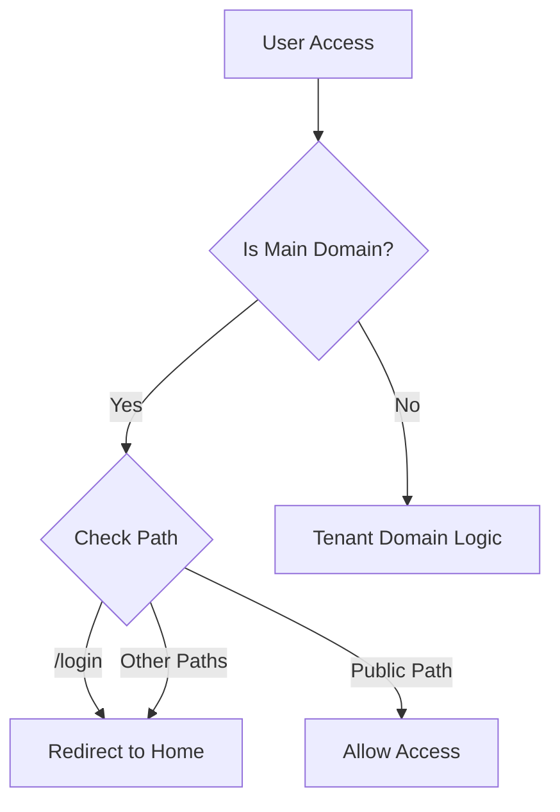

# Authentication Flow Documentation

## Overview
This document outlines the authentication flow implemented in Maamul360, focusing on the multi-tenant architecture with subdomain-based access control.

## Core Components

### 1. Middleware (`middleware.ts`)
Handles routing and access control for the entire application.

#### Path Classifications
- **Bypass Paths**: 
  ```typescript
  ['/_next', '/api', '/static', '/assets', '/favicon.ico']
  ```
  These paths bypass middleware checks.

- **Tenant-Only Paths**:
  ```typescript
  ['/dashboard', '/settings', '/profile', '/inventory', '/reports', '/login']
  ```
  Only accessible on tenant subdomains.

- **Public Paths**:
  ```typescript
  ['/', '/register', '/about', '/contact', '/verify-success', '/verify-email']
  ```
  Accessible on the main domain.

#### Domain Logic
- **Main Domain**: `maamul360.local:3000` or `www.maamul360.local:3000`
- **Tenant Domains**: `{tenant-name}.maamul360.local:3000`

### 2. Login Page (`/app/(auth)/login/page.tsx`)
- Only accessible through tenant subdomains
- Provides tenant-specific authentication
- Redirects to home page if accessed from main domain

### 3. Verification Success Page (`/app/(auth)/verify-success/page.tsx`)
Handles success states for both registration and email verification.

#### Features
- Dynamic success messages based on source
- 3-second countdown timer
- Automatic redirect to tenant login
- Subdomain-aware routing

#### URL Parameters
- `subdomain`: Tenant identifier
- `source`: Either 'registration' or 'verification'

Example URLs:
```
Registration: /verify-success?subdomain=tenant&source=registration
Verification: /verify-success?subdomain=tenant&source=verification
```

## Authentication Flows

### 1. Main Site Access Control


### 2. Registration Flow
1. User registers on main site
2. On success:
   - Shows success toast
   - Redirects to `/verify-success` with subdomain
   - Displays success message with countdown
   - Auto-redirects to tenant login

### 3. Email Verification Flow
1. User clicks verify email link
2. On success:
   - Redirects to `/verify-success` with subdomain
   - Shows verification success message
   - Auto-redirects to tenant login

### 4. Login Access Control
- ❌ Main site login blocked (redirects to home)
- ✅ Tenant login allowed on subdomains

## Security Considerations

1. **Domain Separation**
   - Strict separation between main domain and tenant subdomains
   - Each tenant has isolated login access

2. **Route Protection**
   - Middleware enforces access control on all routes
   - Bypass paths carefully selected for essential functionality

3. **Verification Flow**
   - Secure email verification process
   - Subdomain-aware redirects
   - Auto-redirect to appropriate tenant login

## Implementation Notes

### Middleware Headers
The middleware adds tenant information to requests:
```typescript
requestHeaders.set('x-tenant-subdomain', subdomain)
```

### Verification Success UI
- Clean, user-friendly interface
- Progress indication through countdown
- Clear success messaging
- Automatic redirection for better UX

## Usage Examples

### Registration Success URL
```
http://maamul360.local:3000/verify-success?subdomain=tenant&source=registration
```

### Email Verification Success URL
```
http://maamul360.local:3000/verify-success?subdomain=tenant&source=verification
```

### Tenant Login URL
```
http://{tenant}.maamul360.local:3000/login
```
