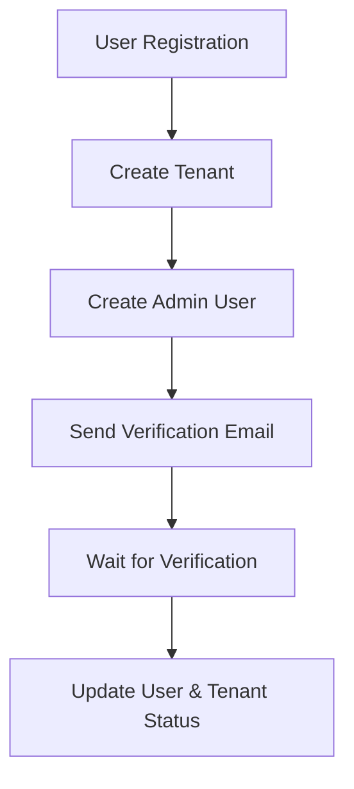

# Maamul360 Authentication Documentation

## Overview
Maamul360 implements a secure, multi-tenant authentication system with email verification. The system handles user registration, email verification, and login across different tenants.

## Authentication Flow

### 1. Registration Process


#### Registration Endpoint
- **URL**: `/api/register`
- **Method**: `POST`
- **Content-Type**: `application/json`
- **Request Body**:
```json
{
  "companyName": "string",
  "companyEmail": "string",
  "password": "string",
  "subdomain": "string",
  "numberOfBranches": number
}
```
- **Success Response**: `201 Created`
```json
{
  "success": true,
  "data": {
    "tenantId": "string",
    "email": "string",
    "subdomain": "string",
    "emailSent": boolean
  },
  "message": "Registration successful! Please check your email to verify your account."
}
```

### 2. Email Verification
- **URL**: `/api/verify-email`
- **Method**: `GET`
- **Query Parameters**: `token`
- **Success Response**: `200 OK`
```json
{
  "success": true,
  "message": "Email verified successfully. You can now log in."
}
```

### 3. Login Process
- **URL**: `/api/login`
- **Method**: `POST`
- **Content-Type**: `application/json`
- **Request Body**:
```json
{
  "email": "string",
  "password": "string",
  "subdomain": "string"
}
```
- **Success Response**: `200 OK`
```json
{
  "success": true,
  "data": {
    "token": "string",
    "user": {
      "id": "string",
      "email": "string",
      "role": "string"
    },
    "tenant": {
      "id": "string",
      "name": "string",
      "subdomain": "string"
    }
  }
}
```

## Email Configuration

### Required Environment Variables
```env
SMTP_HOST="smtp.gmail.com"
SMTP_PORT=587
SMTP_USER="your-email@gmail.com"
SMTP_PASSWORD="your-app-password"
SMTP_FROM_EMAIL="your-email@gmail.com"
SMTP_FROM_NAME="Maamul360"
```

### Gmail Setup Instructions
1. Enable 2-Factor Authentication in your Gmail account
2. Generate an App Password:
   - Go to Google Account Settings
   - Navigate to Security
   - Under "2-Step Verification", click "App passwords"
   - Select "Other (Custom name)"
   - Name it "Maamul360"
   - Copy the generated password to your .env file

## Security Features

### Password Requirements
- Minimum 8 characters
- Must contain at least one number
- Must contain at least one letter
- Special characters are allowed

### Email Verification
- Verification token expires in 24 hours
- One-time use token
- Secure token generation using crypto.randomUUID()

### JWT Authentication
- Token expiration: 24 hours
- Includes user role and tenant information
- Secure signing with HS256 algorithm

## User States

### User Verification Status
- `isVerified: false` - Initial state after registration
- `isVerified: true` - After email verification

### Tenant Status
- `pending` - Initial state after registration
- `active` - After admin user verifies email

## Error Handling

### Common Error Responses
1. Invalid Credentials
```json
{
  "success": false,
  "error": "Invalid credentials"
}
```

2. Unverified Email
```json
{
  "success": false,
  "error": "Please verify your email before logging in",
  "verificationRequired": true
}
```

3. Invalid Tenant
```json
{
  "success": false,
  "error": "Invalid tenant"
}
```

## Testing Tools

### Email Testing Script
```bash
node scripts/test-email.js
```
Verifies SMTP configuration and sends a test email.

### User Verification Check
```bash
node scripts/check-users.js
```
Displays current verification status of all users.

### Tenant Status Fix
```bash
node scripts/fix-tenant.js
```
Updates tenant status for verified admin users.
